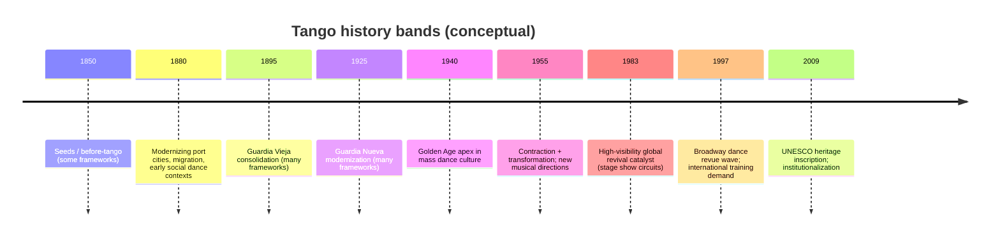
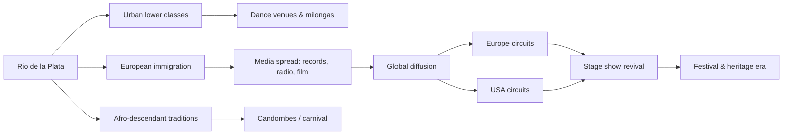

# Critical Review of the TobyTango Tango History Timeline

## Executive summary

The TobyTango “Tango History Timeline” page presents a clear *conceptual scaffold*—multiple parallel “era bands” for Argentina, orchestras, dancers, Europe, and the United States—but, as currently delivered, it is not auditable at the level the format promises because the “Key Events / Eventos Clave” list *does not appear in the page’s static content*, leaving only a “Loading timeline…” placeholder for the actual event entries and their citations. citeturn23view0

The page itself states that the timeline was “researched and compiled using AI assistance (Claude/Anthropic)” and that errors may exist; this transparency is valuable, but it increases the editorial obligation to expose *verifiable sources per entry* and to provide stable citations and versioning. citeturn23view0

At the level that *is* visible (era labels and date ranges), a number of claims are broadly consistent with common tango historiography (e.g., a 1930s–mid-1950s “Golden Age” concept), but several ranges and framings are either (a) nonstandard relative to widely cited periodizations (notably those associated with the Argentine National Tango Academy), or (b) interpretive/forward-looking (“…2012–2030”) without being labeled as such. citeturn23view0turn43search3turn34search0

Substantively, the visible structure under-emphasizes core cross-cutting contexts that authoritative sources treat as foundational: tango as a *shared Río de la Plata* cultural formation across Argentina and Uruguay; Afro-descendant contributions and the politics of their historical erasure; and the role of state policy, media technology, and migration in shaping both music and dance. citeturn25search1turn29search0turn37search2turn39view0

## What is currently extractable from the page

### Inventory of the page’s visible timeline bands and labels

From the static page content, the following “era band” labels and date-ranges are visible (grouped as the page groups them). citeturn23view0

**Tango Argentina**
- “La Guardia Vieja / The Old Guard” — 1880–1920 citeturn23view0  
- “La Guardia Nueva / The New Guard” — 1920–1935 citeturn23view0  
- “La Época de Oro / The Golden Age” — 1935–1955 citeturn23view0  
- “La Decadencia / The Decline” — 1955–1983 citeturn23view0  
- “El Renacimiento / The Rebirth” — (no dates shown) citeturn23view0  
- “La Investigación” — (no dates shown) citeturn23view0  
- “Tango Nuevo Peak” — (no dates shown) citeturn23view0  
- “Neo-Traditional / Return to Roots” — 2012–2030 citeturn23view0  

**Tango Orchestras**
- “Early Orchestras / Guitar, Flute & First Bandoneón” — 1880–1920 citeturn23view0  
- “Guardia Nueva Orchestras / Birth of the Orquesta Típica” — 1920–1935 citeturn23view0  
- “Golden Age Orchestras / The Big Four and More” — 1935–1955 citeturn23view0  
- “Post-Golden Age / Evolution & Decline” — 1955–1990 citeturn23view0  
- “Revival Orchestras / New Generations” — 1990–2030 citeturn23view0  

**Dancers & Couples**
- “Guardian Generation / Living Bridge to Golden Age” — 1935–1960 citeturn23view0  
- “The Dark Years / La Decadencia — When Dancing Stopped” — 1955–1983 citeturn23view0  
- “Bridge Generation / Codifiers and Teachers” — 1980–2000 citeturn23view0  
- “Nuevo Innovators / The Investigation Generation” — 1995–2010 citeturn23view0  
- “Stage Pioneers / Theatrical Tango” — 1983–2000 citeturn23view0  

**Tango Europe**
- “First Tangomania” — (no dates shown) citeturn23view0  
- “Interwar Period / European Golden Period” — 1920–1940 citeturn23view0  
- “The Disconnect / Lost Connection” — 1940–1980 citeturn23view0  
- “Piazzolla’s Europe / Musical Survival” — 1970–1985 citeturn23view0  
- “Paris Explosion” — (no dates shown) citeturn23view0  
- “First Communities” — (no dates shown) citeturn23view0  
- “German & Nordic Wave” — (no dates shown) citeturn23view0  
- “Film & Cultural Legitimacy” — (no dates shown) citeturn23view0  
- “Festival Era” — (no dates shown) citeturn23view0  
- “Maturation / Self-Sustaining Scenes” — 2009–2030 citeturn23view0  

**Tango USA**
- “Early American Tango / Vernon & Irene Castle Era” — 1910–1930 citeturn23view0  
- “Ballroom Era / American Tango Diverges” — 1930–1985 citeturn23view0  
- “Broadway Impact” — (no dates shown) citeturn23view0  
- “American Growth / Coast to Coast” — 1995–2010 citeturn23view0  
- “Contemporary USA / Mature Communities” — 2010–2030 citeturn23view0  

### Linked papers and sources on the page

In the static page content, the timeline’s event list is represented only by the “Key Events / Eventos Clave” header and a “Loading timeline…” placeholder; no event entries, outbound links, papers, or bibliographic references are visible in this extract. citeturn23view0

This is not a minor technical detail; it prevents independent verification of the timeline’s claims *as presented*, which is central to your requested “critical deep-dive” standard.

## Method and evidence base

This review proceeds in two layers:

First, it evaluates the TobyTango page *as a document*—its stated provenance (AI-assisted compilation), its visible claims (era ranges and labels), and its auditability (sources and event entries). citeturn23view0

Second, it cross-checks the visible assumptions against a deliberately “primary-first” reference set, emphasizing: the 2009 inscription of tango as Intangible Cultural Heritage (recognizing both Argentina and Uruguay); recent academic synthesis work (especially a 2024 Cambridge Companion volume with dedicated chapters on Afro-Argentine origins and gendered histories); and institutional sources (municipal cultural histories, national archives, and major library sound and score collections). citeturn25search1turn37search0turn37search2turn39view0turn31search6turn30search2turn30search0

Where paywalls limit full-text access (e.g., many Cambridge Core chapters), this report relies on available abstracts/summaries and flags the access constraint explicitly. citeturn37search1turn37search2turn29search4

## Accuracy and context check of the visible timeline claims

### Comparison table: TobyTango era bands vs authoritative periodizations

The table below compares each visible band (the only “entries” currently extractable) with corroborating sources and where the page’s framing would benefit from revision.

| Timeline band (as shown) | Claimed date/event | Corroborating sources | Discrepancies / concerns | Suggested revision (concise) |
|---|---:|---|---|---|
| La Guardia Vieja / The Old Guard | 1880–1920 | Buenos Aires municipal history places tango’s early emergence in the modernizing, migrant city context “from 1880,” and treats “Guardia Vieja” as the early stage. citeturn39view0 | A prominent periodization attributed to the Argentine National Tango Academy divides “Before Tango/Seeds” (1850–1880), “Prehistory/Genesis” (1880–1895), and “Guardia Vieja” (1895–1925, split into two subperiods). This makes “1880–1920” both early-starting and early-ending relative to that scheme. citeturn43search3 | “**La Guardia Vieja (c. 1895–1925)** — Early consolidation of tango as a recognizable genre and social practice (with prehistory/gestation in the late 19th c.).” (High confidence; align to a cited periodization.) citeturn43search3turn39view0 |
| La Guardia Nueva / The New Guard | 1920–1935 | Municipal history describes “Guardia Nueva” as emerging in “the first decades of the 20th century,” emphasizing sextets including bandoneons, piano, and bass. citeturn39view0 | Academy-linked schemes often treat the “Transformation” period as 1925–1940. citeturn43search3 | “**La Guardia Nueva (c. 1925–1940)** — ‘Decarean’ modernization: new harmonic language, sextet/orquesta típica consolidation, and mediated mass circulation.” (Medium-high confidence; depends on chosen framework.) citeturn43search3turn39view0 |
| La Época de Oro / The Golden Age | 1935–1955 | Multiple syntheses place a Golden Age roughly from mid-1930s to mid-1950s; Buenos Aires municipal history highlights the 1940s as the apex. citeturn39view0turn33search41 | The start/end boundaries vary (some use ~1935–1952, others “mid-1950s”). Treating it as a single clean bracket can conceal regional/media variation and the continued vitality of tango orchestras after 1955 in reduced form. citeturn33search41turn43search3 | “**Época de Oro (c. 1935–mid-1950s; peak in the 1940s)** — mass dance culture + radio/cinema industry.” (High confidence; add note on boundary variability.) citeturn39view0turn33search41 |
| La Decadencia / The Decline | 1955–1983 | Several narratives connect post-1950s decline to political/economic change, censorship, and changing youth culture; a major revival story point is the 1983 Paris premiere of a stage show widely credited with accelerating global revival. citeturn43search3turn28search46turn40search3 | “Decline” risks overstating uniform disappearance: (a) major musical innovations occurred (notably a “nuevo tango” project after Paris study, and later international moves), and (b) tango persisted in smaller venues and in transnational circuits. citeturn39view0turn35search0turn26search0 | “**1955–early 1980s: contraction + transformation** — reduced mass social dancing, evolving musical directions, new circuits; culminates in high-visibility revival (1983).” (Medium-high confidence; avoids ‘dancing stopped’ absolutism.) citeturn35search0turn28search46turn26search0 |
| Orchestras: Birth of the Orquesta Típica | 1920–1935 | The “orquesta típica” is widely associated with tango, and later consolidation is strongly linked to the 1920s and onward. citeturn39view0turn28search48 | Naming/recorded “orquesta típica criolla” appears earlier than 1920 in multiple accounts (including archival-discography based narratives centered on early recordings). citeturn46search4turn46search38 | “**Orquesta típica emergence (c. 1910s–1920s)** — early labeled formations and recordings precede later standardization; major expansion in the 1920s.” (Medium confidence; add citations per claim.) citeturn46search4turn28search48 |
| Dancers: “When Dancing Stopped” | 1955–1983 | Restrictions on public gatherings and broader authoritarian governance are often cited as damaging social dance ecosystems; 1983 is strongly linked to revival. citeturn36search41turn28search46 | The phrasing “stopped” is historically brittle (it suggests zero practice) and should be replaced with “contracted,” “moved,” or “went underground,” plus evidence. citeturn36search41turn26search0 | “**1955–1983: social dance contracts and becomes less publicly visible** (varies by place, class, and venue).” (Medium confidence; depends on local documentation.) citeturn36search41 |
| Europe: “Piazzolla’s Europe” | 1970–1985 | Biographical sources document major Paris relocation in 1974 and return in 1985, along with broader international acclaim in Europe/North America. citeturn35search0turn40news53 | “1970–1985” is not wrong as an “internationalization arc,” but calling it “Europe” specifically should reflect the documented residency window and touring pattern. citeturn35search0 | “**1974–1985: European base + internationalization** (Paris residency; tours/collaborations).” (High confidence.) citeturn35search0 |
| USA: “Broadway Impact” | (no dates shown) | Broadway productions of major tango stage shows are well documented (1980s and 1990s entries). citeturn28search46turn41search0turn41search9 | Without dates, the band is not actionable; it also risks collapsing different impacts: (a) 1980s revival show circuits and (b) 1997–98 long-running Broadway dance revue wave. citeturn28search46turn41search0 | “**Broadway catalysts (1985–86; 1997–98)** — stage shows amplify revival and visibility.” (High confidence; add production citations.) citeturn28search46turn41search0 |
| Post-2009 “Maturation” | 2009–2030 | 2009 is a major heritage milestone (UNESCO inscription). citeturn25search1 | Claiming “maturation” through 2030 is predictive; it should be labeled as editorial interpretation or scenario planning, not history. citeturn23view0turn25search1 | “**2009–present: heritage era** — global institutionalization + scene diversification; future projections should be labeled ‘forecast.’” (High confidence on the 2009 anchor; low-medium on forecasts.) citeturn25search1turn23view0 |

### Key interpretive issue: periodization needs explicit provenance

Because tango periodization varies by author and by whether one is describing the commercial recording industry, social dancing, or compositional style, the timeline should *declare which framework it is using* (or allow switching). The Argentine National Tango Academy–attributed scheme summarized in an IEEE publication provides one widely circulated reference point, and it differs materially from several of TobyTango’s cut points. citeturn43search3turn23view0

A modern editorial solution is to treat era bands as **“approximate historiographic conventions”** and then attach a one-sentence justification plus 2–5 citations per era. This is especially important because the page acknowledges AI-assisted compilation. citeturn23view0turn37search0

## Coverage gaps and bias risks

### Río de la Plata framing and Uruguay’s centrality

The page’s top-level band is labeled “Tango Argentina,” while authoritative heritage framing emphasizes tango as an Argentine–Uruguayan tradition developed by urban lower classes in both Buenos Aires and Montevideo in the Río de la Plata basin. citeturn25search1

A core Uruguayan anchor—“La Cumparsita”—is strongly associated with Montevideo’s Café La Giralda site (today within/under Palacio Salvo, hosting a dedicated museum), a fact commonly used in Uruguayan institutional narration and tourism/museum documentation. citeturn31search3turn31search0turn25search44

**Gap implication:** A timeline that does not give Uruguay its own explicit parallel band (or at least a set of Uruguay-tagged key entries) will predictably reproduce an Argentina-centric master narrative, even if individual entries mention Uruguay later.

### Afro-descendant contributions and the politics of erasure

UNESCO’s own framing emphasizes the mixture of European immigrants, descendants of African slaves, and criollos as part of tango’s development. citeturn25search1 A separate UNESCO article (summarizing an Argentine anti-discrimination institute study) explicitly argues that Afro-descendant presence has been historically erased and links “tangos” to Black community gatherings, candombe/carnival contexts, and late-19th-century consolidation. citeturn29search0

Recent scholarship in the 2024 Cambridge Companion volume includes a chapter specifically on nineteenth-century Afro-Argentine origins, using original research to connect Black musical/dance traditions (candombes) and early tango while challenging the “Afro-Argentine disappearance” narrative. citeturn37search2turn29search4

At the level of concrete early figures, an Argentine public university article cites documentary evidence for Black presence in tango and highlights the Afro-Argentine composer of “El Entrerriano” (1897) as a key early marker. citeturn29search1turn29search45

**Gap implication:** Without these threads, timelines tend to default to a “European immigrant men + brothels” shorthand that is neither wrong nor sufficient—and it erases a central historiographic debate that the page format is otherwise well suited to represent.

### Gender, performance labor, and the “who gets remembered” problem

The visible TobyTango bands include a “Dancers & Couples” track, which creates an opportunity to address gender, labor, and celebrity dynamics; however, without visible event entries we cannot see whether women’s professional roles are treated systematically.

The Cambridge Companion’s chapter summaries explicitly foreground women’s professionalization and social contributions via the “tango cancionista” (female tango singer) and highlights star cancionistas of the 1930s. citeturn37search3 This is precisely the kind of content often missing from popular timelines that focus on male bandleaders and composers.

Contemporary queer tango communities are also part of tango’s “global diffusion and re-signification” story; recent reportage ties queer milongas in Buenos Aires to cultural/political refuge and role fluidity. citeturn25news54 (A deeper treatment would ideally draw on peer-reviewed tango/dance studies, but it is still a visible modern historical layer.)

### Media technology, archives, and “what counts as evidence”

One of the strongest ways to raise the accuracy and authority of a public-facing tango timeline is to ground key turning points in “hard” media records: dated recordings, sheet music, photographs, and playbills.

Examples of authoritative primary sources that map cleanly onto timeline entries include a 1904 photograph in the Argentine National Archive (Archivo General de la Nación) showing men dancing tango, and early U.S. commercial recordings of tango such as a 1912 “El choclo” recording in the Library of Congress National Jukebox collection. citeturn31search7turn47search1

The 2024 Cambridge Companion’s description also frames tango as an early-20th-century global phenomenon, citing a striking statistic about gramophone records between 1903 and 1910. citeturn37search0

**Gap implication:** Without systematically embedding this kind of primary evidence, a timeline invites disputes that cannot be resolved “on-page,” undercutting the value of its interactive design.

image_group{"layout":"carousel","aspect_ratio":"16:9","query":["Hombres bailando tango en el río 1904 Archivo General de la Nación Argentina photo","Museo del Tango La Cumparsita Palacio Salvo Montevideo interior","Library of Congress National Jukebox El Choclo 1912 Victor Orchestra label","Forever Tango Broadway 1997 Playbill cover"],"num_per_query":1}

## Issues to fix with corrections, rewrites, and archive recommendations

Each item below includes: (a) support for the correction, (b) a suggested concise rewrite, (c) confidence level, (d) priority, and (e) primary sources/archives to consult.

### Make every event auditable and exportable

**Support:** The page acknowledges AI-assisted compilation and invites corrections, but the “Key Events” region is not populated in the static content (“Loading timeline…”), and no visible sources are attached to era bands. citeturn23view0

**Suggested revised text:**  
“Each event includes citations to primary records (scores, recordings, photos) and to peer-reviewed or institutional history. Use the ‘Sources’ toggle to view the evidence and an ‘Edit history’ toggle to track changes.” citeturn31search6turn30search2turn37search0

**Confidence:** High (this is a structural/documentation issue observed directly). citeturn23view0  
**Priority:** High  
**Recommended primary sources/archives:** national archives and libraries with digitized collections (e.g., the Argentine National Archive’s digitized fonds list; major sound/score holdings at national libraries and the Library of Congress). citeturn31search6turn31search1turn30search2turn30search0

### Reframe “Tango Argentina” as a Río de la Plata formation

**Support:** UNESCO frames tango as an Argentinian and Uruguayan tradition developed in Buenos Aires and Montevideo within the Río de la Plata basin. citeturn25search1

**Suggested revised text:**  
“**Tango in the Río de la Plata (Argentina & Uruguay)** — A shared urban tradition shaped in Buenos Aires and Montevideo.” citeturn25search1

**Confidence:** High  
**Priority:** High  
**Recommended primary sources/archives:** Uruguayan museum and library holdings explicitly documenting “La Cumparsita” and early tango history displays, plus Uruguayan national library special collections that preserve tango sheet music. citeturn31search3turn45search0turn45search5

### Correct or contextualize era boundaries using named historiographic frameworks

**Support:** A widely circulated periodization attributed to the Argentine National Tango Academy (via an IEEE publication) splits “Seeds/Prehistory” and “Guardia Vieja I/II,” with “Golden Age/Exaltation” centered on 1940–1955. citeturn43search3 Buenos Aires municipal history supports an 1880s modernization context and highlights the 1940s apex. citeturn39view0

**Suggested revised text:**  
“Era bands are **approximate** and depend on whether one is tracking social dance, recording industry, or compositional style. Switch frameworks: ‘Academia Nacional del Tango’ / ‘Municipal history’ / ‘Scholarly synthesis’.” citeturn43search3turn39view0turn37search0

**Confidence:** High (framework variance is well documented)  
**Priority:** High  
**Recommended primary sources/archives:** institutional timelines and curated exhibitions, especially the Museo Mundial del Tango (as academy seat) and municipal cultural programming archives. citeturn43search0turn34search0turn45search8

### Add Afro-descendant contributions as a first-class strand

**Support:** UNESCO explicitly includes descendants of African slaves in tango’s formation; UNESCO also highlights erased Afro-descendant presence and links candombes/carnival to tango’s evolution. citeturn25search1turn29search0 The Cambridge Companion includes a dedicated chapter that uses original research to connect candombes and early tango, challenging erasure narratives. citeturn37search2turn29search4 A major Argentine public university article cites documentary abundance and uses “El Entrerriano” (1897) as an illustrative early marker tied to an Afro-Argentine composer. citeturn29search1turn29search45

**Suggested revised text:**  
“**Afro-descendant roots and erasure debates** — Candombes/carnival traditions and Black musicianship were foundational; later narratives often minimized this role.” citeturn37search2turn29search0

**Confidence:** High on “include this as foundational,” medium on any single causal claim (because scholarship debates particulars). citeturn37search2turn29search0  
**Priority:** High  
**Recommended primary sources/archives:** university-based documentation collections; national libraries’ sheet music; and archives tied to authorship-rights documentation (e.g., the Gerardo Matos Rodríguez documentary collection recognized via Uruguay’s UNESCO commission). citeturn29search1turn45search0turn45search5

### Replace absolutist phrasing like “When Dancing Stopped”

**Support:** Public narratives often document restrictions and contraction of social dancing under authoritarian conditions, but also document continuities and transformations (including major musical developments and later revival catalysts). citeturn36search41turn35search0turn28search46turn26search0

**Suggested revised text:**  
“**Public milongas contract; tango shifts venues and circuits** — social dancing becomes less visible and less mass, while music and staged tango develop new pathways.” citeturn26search0turn28search46

**Confidence:** Medium-high  
**Priority:** Medium-high  
**Recommended primary sources/archives:** venue permits/police records (where accessible), oral histories with dancers active pre- and post-1983, and concert/stage production archives (playbills, touring records). citeturn28search46turn41search0turn40search3

### Clarify “orquesta típica” emergence vs later standardization

**Support:** Municipal history describes early ensembles (flute/violin/guitar) and later sextets including bandoneons/piano/bass. citeturn39view0 A discography-focused narrative traces early “orquesta típica criolla” naming/recording to the early 1910s, with supporting references to period advertising and early record labels. citeturn46search4

**Suggested revised text:**  
“**Orquesta típica emergence (1910s) + standardization (1920s–30s)** — early labeled formations and recordings precede the later ‘canonical’ instrumentation.” citeturn46search4turn39view0

**Confidence:** Medium (because definitions vary by author and by “first labeling” vs “full standard lineup”)  
**Priority:** Medium  
**Recommended primary sources/archives:** digitized record advertisements, label catalogs, and early recording archives; cross-check with national library score holdings and contemporary press. citeturn46search4turn31search6turn30search2

### Add Broadway and stage-show nodes with dates and citations

**Support:** Major stage shows are documented as revival catalysts and as “U.S. diffusion accelerators,” including a 1983 Paris premiere that toured and reached Broadway mid-1980s, and a 1997 Broadway production history for a long-running dance revue (with official production database entries). citeturn28search46turn40search3turn41search0turn41search9

**Suggested revised text:**  
“**Stage-show accelerators** — 1983–86 and 1997–98 Broadway-era productions amplify global visibility and training-demand.” citeturn28search46turn41search0

**Confidence:** High  
**Priority:** Medium  
**Recommended primary sources/archives:** Playbill archives and the official Internet Broadway Database, plus newspaper reviewing archives for reception history. citeturn41search0turn41search9turn28search2

## Research and editing roadmap

### Short-term edits

Replace the current “trust me” structure with **inline, per-event citations** and add an exportable bibliography view; the page’s own AI provenance statement makes this essential. citeturn23view0turn37search0

Re-title or re-scope “Tango Argentina” to the Río de la Plata frame and add Uruguay-tagged entries and sources as first-class citizens (not peripheral notes). citeturn25search1turn31search3

Normalize era labels as “approximate conventions” and attach a one-sentence explanation with references (e.g., municipal history; academy-linked periodizations; recent scholarly synthesis). citeturn39view0turn43search3turn37search0

### Medium-term research

Build a source pipeline that privileges **primary media records** (scores, recordings, photographs, playbills), using national archives and major library sound collections; this will raise confidence levels for disputed early history. citeturn31search6turn30search2turn30search0turn31search7

Commission or solicit short expert annotations for contested domains (Afro-descendant roots; Uruguay–Argentina co-development; periodization debates), drawing on recent scholarship synthesized in major academic reference works. citeturn37search2turn29search4turn29search0

### Long-term projects

Produce an **annotated, versioned timeline** (a “timeline-as-archive finding aid”) that links every node to (a) a primary record when possible, (b) a curated secondary source, and (c) a brief historiographic note (“what scholars disagree about and why”). citeturn37search0turn25search1turn31search6

Develop a small **digital exhibit** prototype for three pivotal clusters: “Origins and Afro-descendant debates,” “Golden Age media ecology,” and “1980s–2000s revival circuits (stage shows + festivals + recordings).” citeturn29search0turn39view0turn28search46turn41search0

## Mermaid diagrams for relationships



The choice of 1850/1880/1895/1925/1940/1955/1983/1997/2009 as “anchors” is supported by institutional and scholarly synthesis sources, but the precise boundaries remain framework-dependent. citeturn43search3turn39view0turn28search46turn41search0turn25search1turn37search0



This relationship model reflects authoritative heritage framing (shared Argentina–Uruguay development; hybrid cultural formation) and recent scholarship emphasizing Afro-descendant roots; it also captures the widely cited role of staged productions as diffusion accelerators. citeturn25search1turn29search0turn37search2turn28search46turn41search0

## Source list with links

```text
TOBYTANGO PAGE
https://www.tobytango.com/tango-history

FOUNDATIONAL INSTITUTIONAL / SCHOLARLY SYNTHESIS
https://ich.unesco.org/en/rl/tango-00258
https://www.cambridge.org/core/books/cambridge-companion-to-tango/3BC7F58C563B0BEA422B3BEB71DE1065
https://www.cambridge.org/core/books/cambridge-companion-to-tango/nineteenthcentury-afroargentine-origins-of-tango/AC8DBFF85744E811D3315E22FADFC776
https://press.uchicago.edu/ucp/books/book/chicago/T/bo24313021.html
https://www.britannica.com/biography/Astor-Piazzolla
https://www.unesco.org/en/articles/tango-also-afro
https://unlp.edu.ar/arte/museo_azzarini/tango_investigacion_origenes_negros_dic_2012-7793-12793/

MUNICIPAL / GOVERNMENT CULTURAL HISTORY
https://buenosaires.gob.ar/noticias/breve-historia-del-tango

ARCHIVES, MUSEUMS, AND PRIMARY MEDIA (SELECTED)
https://www.argentina.gob.ar/interior/archivo-general/fondos-consulta
https://commons.wikimedia.org/wiki/File:Hombres_bailando_tango_en_el_r%C3%ADo,_1904.jpg
https://www.loc.gov/item/jukebox-132231/
https://www.loc.gov/item/jukebox-132753/
https://www.loc.gov/item/2016765139/
https://www.museos.gub.uy/index.php/museos/museos-por-localidad/montevideo/item/1303-museo-del-tango-la-cumparsita
https://www.descubrimontevideo.uy/museo-del-tango
https://www.iaml.info/uruguay
https://comisionunesco.org.uy/matosrodriguez-archivo-uruguayo-es-memoriadelmundo-de-la-unesco/

STAGE / BROADWAY PRODUCTION RECORDS
https://en.wikipedia.org/wiki/Tango_Argentino_(musical)
https://playbill.com/production/forever-tango-walter-kerr-theatre-vault-0000010046
https://www.ibdb.com/broadway-show/forever-tango-3680

ORCHESTRA TÍPICA / EARLY RECORDING DISCOGRAPHY NARRATIVES (SUPPORTING)
https://www.todotango.com/english/history/chronicle/184/The-first-recording-of-an-%C2%ABOrquesta-Tipica%C2%BB/
```